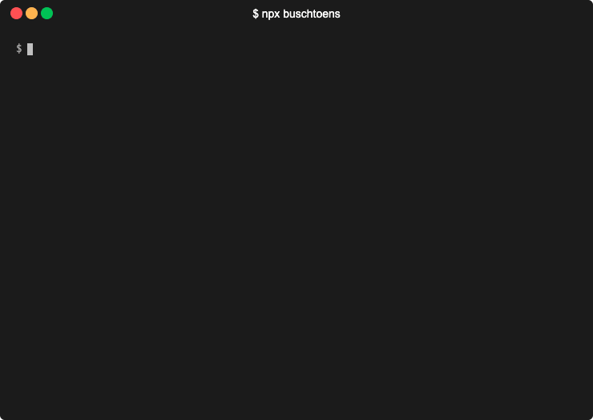

# `buschtoens`

The [Jan Buschtöns][website] CLI. For all your [**@buschtoens**][github]
desires.

[website]: https://jan.buschtoens.me
[github]: https://github.com/buschtoens

<p align="center">
  
</p>

## Usage

[Install Node.js][volta], then:

```sh
# If using `npm`:
$ npx buschtoens

# If using `pnpm`:
$ pnpx buschtoens
```

[volta]: https://volta.sh
